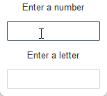

# 验证用户输入

任何基于 `Entry` 的小部件都可以验证用户输入。 当小部件处于 **invalid** 状态时，边框颜色将变为 **danger** 颜色。



在此示例中，验证类型为`focus`，这意味着每次小部件接收或失去焦点时都会运行验证函数。 还有几种其他类型的验证，以及许多配置验证的方法。 未来的教程将对此进行更详细的讨论，但与此同时，您可以查阅 [tcl/tk 文档](https://tcl.tk/man/tcl8.6/TkCmd/ttk_entry.htm) 了解更多关于什么可用于验证的信息。

```python
import ttkbootstrap as ttk
from ttkbootstrap.constants import *

def validate_number(x) -> bool:
    """Validates that the input is a number"""
    if x.isdigit():
        return True
    elif x == "":
        return True
    else:
        return False

def validate_alpha(x) -> bool:
    """Validates that the input is alpha"""
    if x.isdigit():
        return False
    elif x == "":
        return True
    else:
        return True

# create the toplevel window
root = ttk.Window()
frame = ttk.Frame(root, padding=10)
frame.pack(fill=BOTH, expand=YES)

# register the validation callback
digit_func = root.register(validate_number)
alpha_func = root.register(validate_alpha)

# validate numeric entry
ttk.Label(frame, text="Enter a number").pack()
num_entry = ttk.Entry(frame, validate="focus", validatecommand=(digit_func, '%P'))
num_entry.pack(padx=10, pady=10, expand=True)

# validate alpha entry
ttk.Label(frame, text="Enter a letter").pack()
let_entry = ttk.Entry(frame, validate="focus", validatecommand=(alpha_func, '%P'))
let_entry.pack(padx=10, pady=10, expand=True)

root.mainloop()
```